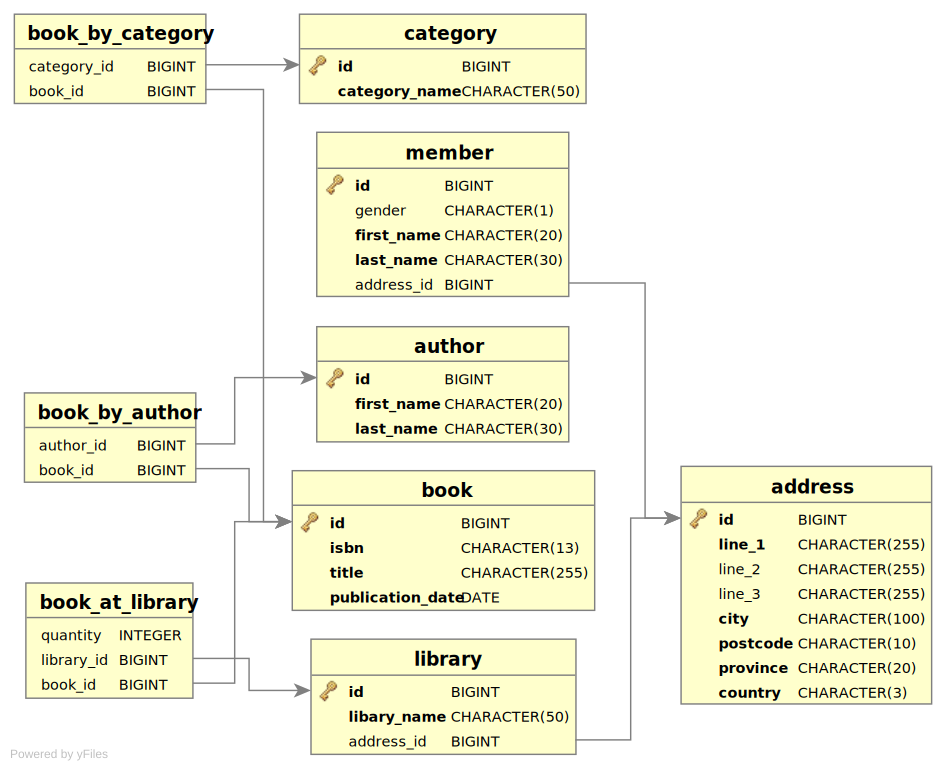

= Java Persistence API
Jason Porter @lightguardjp
2015-03-12
:revealjs_theme: sky
:revealjsdir: ../../reveal.js 

== Introduction

JPA is extremely flexible.
Because of it's flexibility, it is complex.
There's often more than one way to do things.

== Today's schema

== !

[NOTE.speaker]
--
Show the project and explain that we'll be doing a lot of code diving.
--

== Entites

Core of JPA.
Basic concept: class <==> table.

=== Basic Mapping 

=== !

`java.lang.*` maps 1:1 without any extra annotations.

=== Overriding

There is `@Basic` but it really isn't needed, `FetchType` may be useful in some cases.  

`@Column` if the name of the property / method doesn't match, or other info needed.

=== Access Type

`@Access` came out in JPA 2.0, before it was implicit based on where the annotations where.

=== Property Access

[%step]
* Portability
* Logic in the accessor methods

=== Transient
=== PK and id

==== Composite Keys

One of these cases where there are more than one way of doing things.

=== `@Embeddable` / `@EmbeddedId`
=== `@IdClass` 

`@IdClass` goes on the main entity, the key class doesn't need anything special.

=== `@MapsId`

=== Object Identity / PK

There is a difference, make sure you understand what that difference is.

=== Serializable

If your entities will be traveling, make them serializable, otherwise it doesn't matter.

== Relationships

Second most important thing to understand about JPA.

=== Set / Bag / Map 

Set / Collection (List) / Map

[%step]
* List Order
* Portability

=== Bidirectional / Unidirectional
=== 1:N / N:1
=== N:N
=== 1:1
=== Eager / Lazy
=== Cascading
=== Orphan
== Type Converters
== Inheritance

[NOTE.speaker]
--
Look at adding a book with an illustrator, based on time
--

== Queries
Many different types, all have interfaces.

=== Query
=== Typed
=== Named 
=== Native

`@NamedNativeQuery` or `EntityManger.createNativeQuery` should use `@SqlResultSetMapping` for the mapping.

Can return back managed or unmanaged objects or scalars.

=== Stored Proc

Yes, it can be done with `@StoredProcedureQuery` or `@NamedStoredProcedureQuery`.

=== Flush Mode

`FlushModeType`: `COMMIT` and `AUTO`.

[NOTE.speaker]
--
This tells the `EntityManager` when to send things back to the database.
--

Set at the `EntityManager` or `Query` Level.

[NOTE.speaker]
--
`Query` level overrides.
--

Works at the transaction level.

=== Parameters
=== Criteria API

Very much out of scope, spec has very good information.

== Life cylce

New instance -> managed entity -> detached entity -> removed entity

=== Creation
=== Persisting
=== Removal
=== Sync

Usually the container will take care of this.

If `SynchronizationType.UNSYNCHRONIZED` or application managed PC, sync happens when `EntityManager.joinTransaction` happens.

=== Refresh

The entity must be managed, otherwise an exception is thrown.
All data in the entity is overridden with what is in the database.

=== Evicting

Different from removal.
`flush` must be called before `detach` to mantain portability and state changes are applied.
Results in the entity becoming detached.

=== Detach

The object continues to live outside of the scope of it's PC.
Any calls to `LAZY` fetch properties or collections result in an exception.

== Callbacks

* PrePersist
* PostPersist
* PreRemove 
* PostRemove
* PreUpdate
* PostUpdate 
* PostLoad

== Locking

Do yourself a favor and use optimistic locking whenever possible.

=== Pessimistic
=== Optimistic

Use the `@Version` annotation.

Valid types: 

* int / Integer
* short / Short
* long / Long
* java.sql.Timestamp

== Persistence Context

`TRANSACTION` (default) or `EXTENDED` more advanced.

== Packaging
=== persistence.xml
=== datasource
=== mapping file
=== excluded / unlisted classes
== Annotations / XML

== Materials

https://github.com/lightguard/jpa_introduction

//=== Entity Graphs (Not covering)
//=== Metamodel (Not Covering)
//=== Exceptions (Not Covering)
